# 🩺 Glucose-Insulin Dynamics Modeling: A Comparative Study of Numerical Methods and Physics-Informed Neural Networks

[](https://python.org)
[](https://tensorflow.org)
[](https://scipy.org)
[](https://opensource.org/licenses/MIT)
[](https://eng.cu.edu.eg/)

> *Bridging traditional numerical methods with cutting-edge machine learning for biomedical engineering applications*

## 🎯 Project Overview

This project presents a comprehensive comparative analysis of **traditional numerical methods** and **Physics-Informed Neural Networks (PINNs)** for modeling glucose-insulin dynamics during a Glucose Tolerance Test (GTT). Developed as part of the Numerical Methods in Biomedical Engineering course at Cairo University's Faculty of Engineering.

### 🔬 The Medical Context

The Glucose Tolerance Test is a critical diagnostic tool for evaluating diabetes mellitus and insulin resistance. This project mathematically models the complex physiological processes that govern blood glucose regulation, providing insights into:

- **Diabetes Diagnosis**: Early detection and classification of diabetic conditions
- **Insulin Sensitivity Assessment**: Quantitative evaluation of metabolic health
- **Personalized Medicine**: Tailored treatment approaches based on individual glucose-insulin dynamics

## 🧮 Mathematical Foundation

Our model is based on a coupled system of **nonlinear ordinary differential equations (ODEs)** that capture the essential physiological mechanisms:

### Glucose Dynamics
```
For G(t) < Gₖ: Cₘ(dG/dt) = Q + In(t) - GₘIG - DₘG
For G(t) ≥ Gₖ: Cₘ(dG/dt) = Q + In(t) - GₘIG - DₘG - Mᵤ(G - Gₖ)
```

### Insulin Dynamics  
```
For G(t) < G₀: Cᵢ(dI/dt) = -AₐI
For G(t) ≥ G₀: Cᵢ(dI/dt) = -AₐI + Bᵦ(G - G₀)
```

Where each parameter represents specific physiological processes like hepatic glucose production, insulin-mediated uptake, and pancreatic insulin release.

## 📘 Numerical Methods for Solving ODEs in Glucose-Insulin Modeling 
This notebook implements and compares **five numerical methods** for solving systems of ordinary differential equations (ODEs) in the context of **glucose-insulin dynamics**. Each method is applied to a system of biological ODEs with time-varying input and conditional behavior.


### 🚀 What's Inside?
<table>
  <thead>
    <tr>
      <th>Method</th>
      <th>Description</th>
      <th>Book</th>
    </tr>
  </thead>
  <tbody>
    <tr>
      <td>ISODA</td>
      <td>A stiff ODE solver using adaptive step-size control and automatic method switching (e.g., BDF and Adams). Often used in real-world stiff ODE systems.</td>
      <td>✅</td>
    </tr>
	     <tr>
      <td>Classical 4th-order Runge-Kutta method</td>
      <td>Widely used, fixed-step solver. Computes intermediate slopes (k1–k4) to estimate the solution with good accuracy.</td>
      <td>✅</td>
    </tr>
    <tr>
      <td>Newton-Raphson with Backward Euler</td>
      <td>A first-order implicit method solving nonlinear equations at each step using Newton-Raphson. Very stable for stiff problems but requires Jacobian.</td>
      <td>❌</td>
    </tr>
    <tr>
      <td>Trapezoidal</td>
      <td>An implicit method averaging the slope at the current and next time steps. It’s A-stable and more suited for moderately stiff problems.</td>
      <td>❌</td>
    </tr>
 
<tr>
      <td>Midpoint</td>
      <td>A second-order explicit method that estimates midpoint to improve over Euler’s method. More accurate but still not suitable for stiff equations.</td>
      <td>❌</td>
    </tr>
  </tbody>
	
</table>


### 📊 Key Concepts

| Concept                 | Description |
|------------------------|-------------|
| **ODE System**         | Models glucose (`G`) and insulin (`I`) based on medical equations and physiological thresholds. |
| **Conditional Logic**  | The model includes threshold behavior (`Gk`, `G0`) affecting both glucose and insulin rates. |
| **Glucose Infusion**   | Modeled as a time-based piecewise function to simulate external glucose input. |


## 📂 Methods Breakdown

### 🧮 1. ISODA (via `solve_ivp`)
- Uses `scipy.integrate.solve_ivp` with default (LSODA-like) method.
- Automatically switches between stiff and non-stiff solvers.
- Simple to use, good for reference or real-world deployment.

### ⚙️ 2. Classical Runge-Kutta (4th Order)
```python
for i in range(n):
    k1 = h * f(t[i], y[i], params)
    k2 = h * f(t[i] + h/2, y[i] + k1/2, params)
    k3 = h * f(t[i] + h/2, y[i] + k2/2, params)
    k4 = h * f(t[i] + h, y[i] + k3, params)
    y[i+1] = y[i] + (k1 + 2*k2 + 2*k3 + k4) / 6
```

### 🔁 3. Trapezoidal Method (Implicit)
- Uses the average of current and next step derivatives.
- Solved using fixed-point iteration:
```python
y_next = y_prev + h/2 * (f(t_prev, y_prev) + f(t_next, y_next))
```

### 🔄 4. Backward Euler with Newton-Raphson
- Very stable for stiff ODEs.
- Iteratively solves:
```python
y_next = y_prev + h * f(t_next, y_next)
```
- Uses numerical Jacobians to perform Newton-Raphson iteration.

### ➕ 5. Midpoint Method (Explicit, 2nd Order)

- A second-order Runge-Kutta method (also called RK2).
- Improves accuracy over Forward Euler by estimating the derivative at the midpoint of the interval.
- More stable than Euler, but not suitable for stiff systems.

```python
for i in range(n):
    k1 = h * f(t[i], y[i], params)
    k2 = h * f(t[i] + h / 2, y[i] + k1 / 2, params)
    y[i+1] = y[i] + k2
```


## 🧠 Physics-Informed Neural Network (PINN) for Glucose-Insulin Dynamics


### 📋 Description

The notebook simulates and predicts **glucose (G)** and **insulin (I)** behavior using a neural network trained not only on data but also on the governing differential equations of the biological system. It addresses four physiological cases involving glucose infusion and pancreatic sensitivity variation.


### 🚀 What’s Inside?

| Section                          | Description                                                                                   |
|----------------------------------|-----------------------------------------------------------------------------------------------|
| `Imports`                        | TensorFlow, NumPy, SciPy, and Matplotlib for modeling and plotting.                          |
| `Parameters & Initial Conditions`| Defines constants like glucose clearance rate, pancreatic sensitivity, and initial states.   |
| `Case Definitions`               | Four experimental cases simulating different biological conditions (infusion & sensitivity). |
| `Glucose Infusion Function`      | Models glucose input over time as a step function.                                           |
| `Smooth Switch Function`         | Implements a sigmoid-based smooth transition to avoid discontinuities.                      |
| `PINN Model Class`               | A deep neural network using `swish` activations to predict glucose and insulin dynamics.     |
| `Loss Function`                  | Combines data loss with residuals from differential equations (`dG/dt`, `dI/dt`).            |
| `Training Loop`                  | Trains the PINN by minimizing the residual-based loss using TensorFlow optimizers.          |
| `Visualization`                  | Plots predicted glucose-insulin curves for all cases.                                        |


This project complements traditional ODE-based simulation of glucose and insulin dynamics by applying a deep learning technique known as a **Physics-Informed Neural Network (PINN)**. 

PINNs embed the system's **physical laws (ODEs)** directly into the neural network’s training process. This allows the network to learn biologically plausible and physically consistent behavior from time-series data, **without requiring large training datasets**.


### 📌 Overview
- **Problem domain**: Simulating glucose and insulin concentration in response to a glucose tolerance test.
- **Approach**: Use of a PINN that enforces the underlying ODEs governing glucose-insulin kinetics.
- **Framework**: TensorFlow 2.x + SciPy + Matplotlib
- **Models evaluated**: 4 cases with different infusion levels and pancreatic sensitivity

### 🧠 What is a Physics-Informed Neural Network (PINN)?
A Physics-Informed Neural Network (PINN) is a neural network that learns directly from the governing physical laws of the system, typically written as **ODEs or PDEs**. Instead of just predicting outputs from inputs, a PINN is trained so that its outputs satisfy the governing differential equations using **automatic differentiation**.

PINNs embed the system's physical laws (ODEs) directly into the neural network’s training process. This allows the network to learn biologically plausible and physically consistent behavior directly from the governing equations, without requiring any labeled or time-series data. — making them a form of **unsupervised learning constrained by physics**.

### 🔬 Key Benefits of PINNs:
- Learn solutions to differential equations
- Embed known physical laws in the model
- Require little or no labeled data
- Allow real-time or parallel simulations once trained


## 🏗️ Neural Network Architecture
- **Input layer**: \( t \in \mathbb{R} \) (time)
- **Hidden layers**: 4 fully connected layers with 128 neurons each
- **Activation function**: `swish` (smooth, non-monotonic, better for gradient flow)
- **Output layer**: \( [G(t), I(t)] \) — predicted glucose and insulin concentrations


## 📉 Loss Function
The model is trained to minimize the following composite loss function:

```math
\mathcal{L}_{\text{total}} = \text{MSE}_{\text{ODE}} + 100 \cdot \text{MSE}_{\text{IC}}
```

Where:
```math
( \text{MSE}_{\text{ODE}} = \left( \frac{dG}{dt} - \text{ODE}_G \right)^2 + \left( \frac{dI}{dt} - \text{ODE}_I \right)^2 )
 ```
```math
( \text{MSE}_{\text{IC}} = (G(0) - G_{\text{init}})^2 + (I(0) - I_{\text{init}})^2 )
```
> The ODE residual is the difference between what the ODE says should happen and what the neural network predicts is happening. A perfect solution would have a residual of zero.

- In PINNs, automatic differentiation is used to compute the exact derivative of the neural network's predicted function, not the true derivative of the physical system. This predicted derivative is then compared to the right-hand side of the governing differential equation. The difference (residual) is minimized during training to guide the network toward a solution that obeys the underlying physics.

## ⚙️ Training Strategy
The training process used a **two-stage optimization** strategy:

### 1️⃣ Adam Optimizer (Pretraining)
- First-order gradient-based optimizer
- Fast convergence and adaptive learning rates
- 10000 epochs for coarse convergence

### 2️⃣ L-BFGS-B Optimizer (Fine-tuning)
- A second order optimizer (uses curvature information )
- Quasi-Newton second-order optimizer
- Ideal for smooth problems like ODE residual minimization
- Greatly improves precision after Adam

> **Why two optimizers?** Adam moves weights quickly toward a good region. L-BFGS-B fine-tunes that solution to high accuracy using curvature information.


## ⏱️ Time Domain Setup
- Domain: \( t \in [0, 12] \) hours
- High resolution during early spike (0–2h), coarser resolution after
- Smooth sigmoid-based switching handles different physiological regimes in the ODE system


## 🧪 Initial Conditions
Set to physiological baselines:
- \( G(0) = 81.14 \) mg/dL
- \( I(0) = 5.671 \) mg/dL


## 📂 Output of PINN

Plots of glucose and insulin vs. time for each of the 4 cases, comparing PINN predictions to reference ODE solutions.

---
<div name="Screenshots" align="center">
   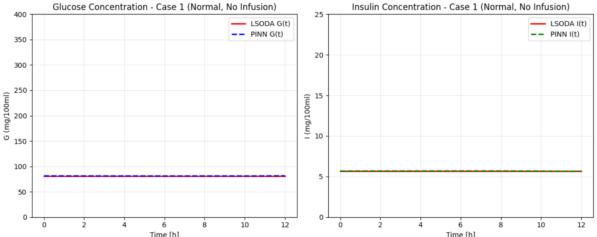
   <hr>
	
   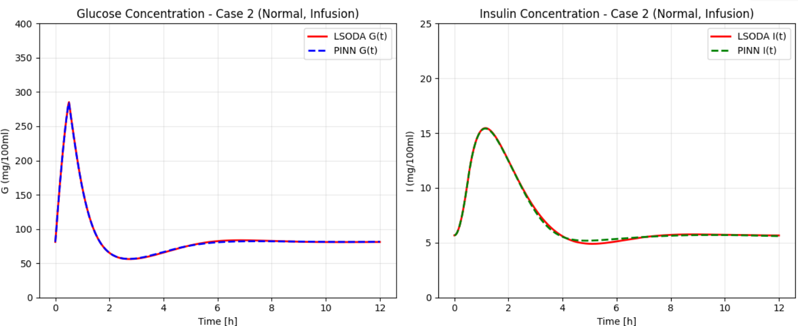
  
   <hr>
          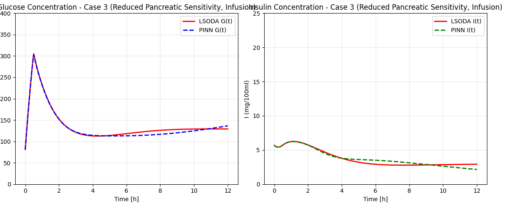
    <hr>
   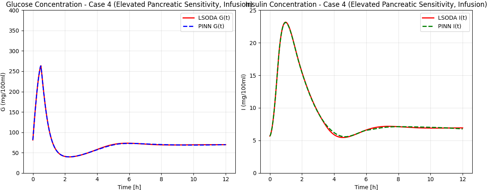
   <hr>
</div>

---

## 📂 Output of methods

The notebook provides **visual plots** for each method:
- Time-series of **glucose and insulin** concentrations.
- Comparison between methods.

<div name="Screenshots" align="center">
   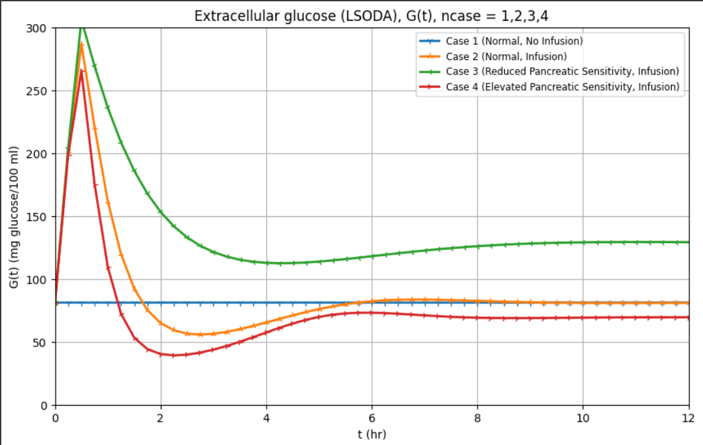
   <hr>
	
   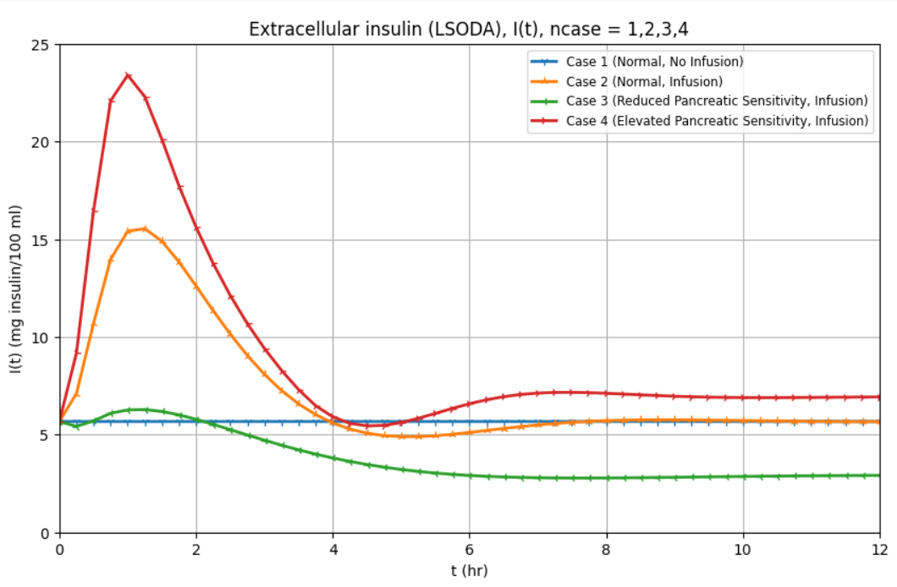
  
   <hr>
          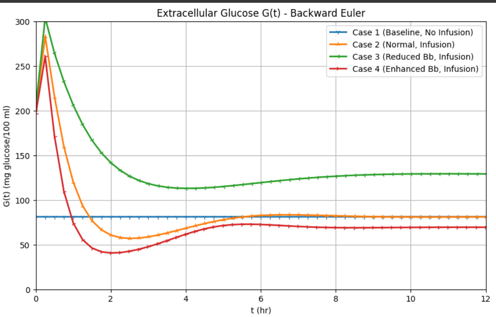
    <hr>
   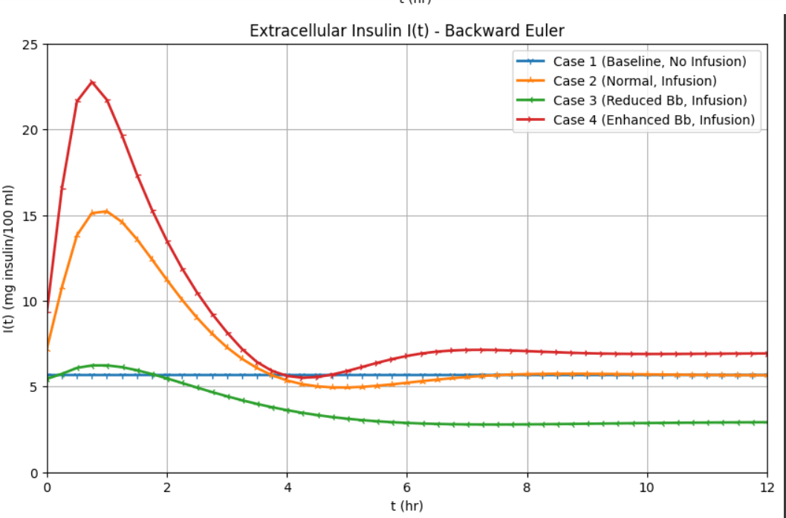
   <hr>
   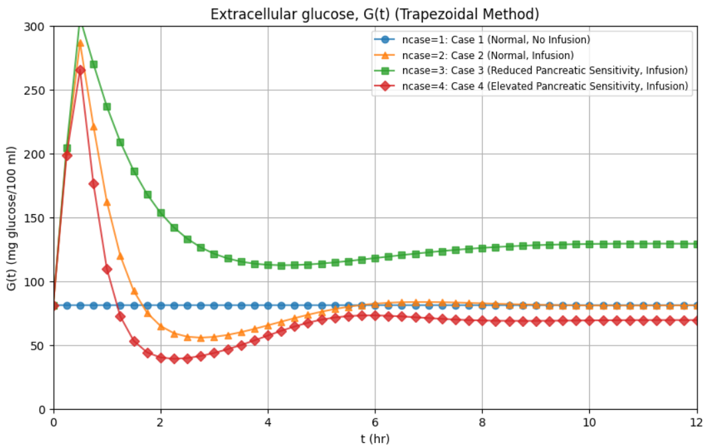
   <hr>
	
   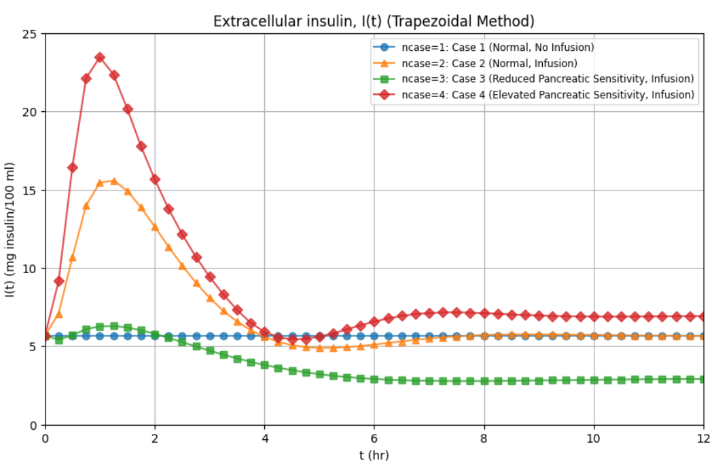
  
   <hr>
          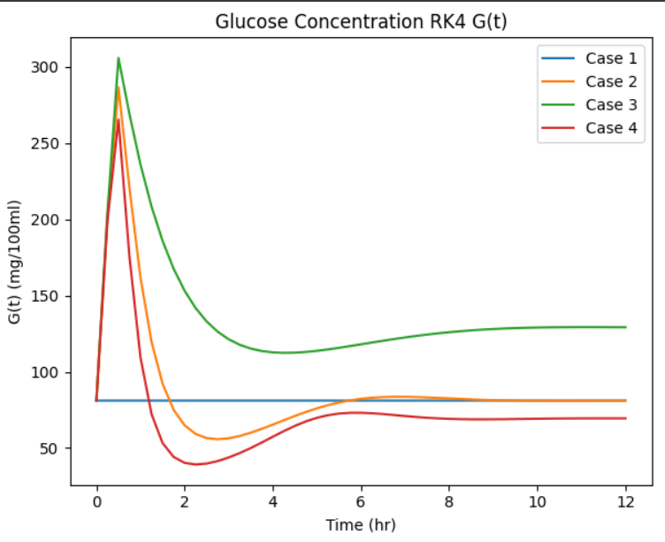
    <hr>
   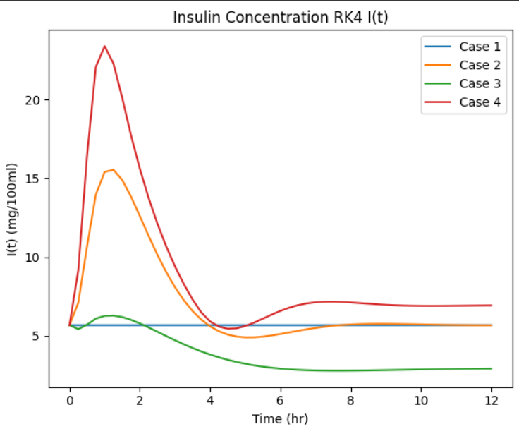
   <hr>
      <hr>
   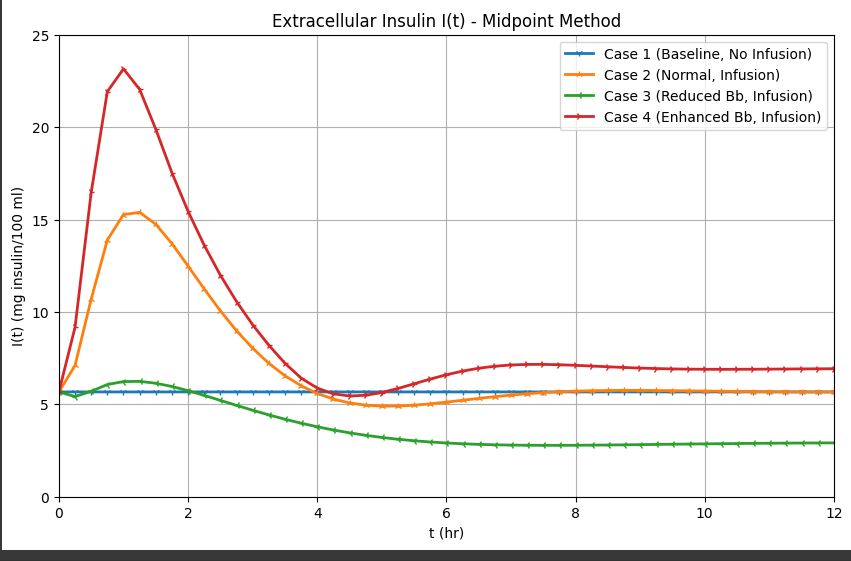
   <hr>
      <hr>
   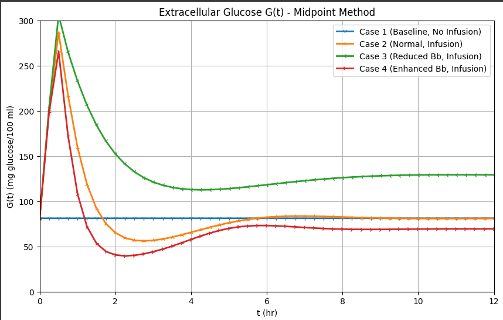
   <hr>
</div>


---

## 📊 Key Results & Performance

| Method | Execution Time | Max Glucose Error | Max Insulin Error |
|--------|---------------|-------------------|-------------------|
| **LSODA** | 4.97×10⁻³ s | Reference | Reference |
| **RK45** | 6.46×10⁻² s | 7.01×10⁻⁷ | 8.14×10⁻⁷ |
| **Trapezoidal** | 8.59×10⁻² s | 7.00×10⁻⁷ | 8.14×10⁻⁷ |
| **PINN** | 3.46×10⁻² s | 1.6×10⁻¹ | 3.54×10⁻² |

### 🏆 Key Findings
- **Traditional methods** achieve exceptional accuracy (10⁻⁷ relative error)
- **PINN** demonstrates competitive performance while learning purely from physics
- **LSODA** consistently fastest for execution
- **Trapezoidal method** shows best accuracy across most test cases

## 🗂️ Repository Structure

```
📦 ML-Numerical-Diabetes-Glucose-ODE-Modeling/
├── 📓 ODE_Numerical_methods.ipynb     # Classical numerical methods implementation
├── 📓 PINN.ipynb                      # Physics-Informed Neural Network model
├── 📄 Cast Study Report.pdf           # Comprehensive project case study
├── 📄 README.md                       # Project documentation (this file)
├── 📄 LICENSE                         # MIT License file
├── 📁 Methods_Screenshots/            # Numerical methods results visualization
│   ├── 🖼️ Screenshot_1.png           # LSODA method results
│   ├── 🖼️ Screenshot_2.png           # RK45 method comparison
│   ├── 🖼️ Screenshot_3.png           # Trapezoidal method analysis
│   ├── 🖼️ Screenshot_4.png           # Backward Euler results
│   ├── 🖼️ Screenshot_5.png           # Comparative trajectories (all methods)
│   ├── 🖼️ Screenshot_6.png           # Glucose concentration plots
│   ├── 🖼️ Screenshot_7.png           # Insulin concentration plots
│   ├── 🖼️ Screenshot_8.png           # Error analysis visualization
│   ├── 🖼️ Screenshot_9.png           # Performance metrics comparison
│   └── 🖼️ Screenshot_10.png          # Method ranking and statistics
├── 📁 PINN_Screenshots/               # Physics-Informed Neural Network results
│   ├── 🖼️ 1.png                      # PINN vs ODE comparison (Case 1)
│   ├── 🖼️ 2.png                      # Healthy response modeling (Case 2)
│   ├── 🖼️ 3.png                      # Reduced pancreatic sensitivity (Case 3)
│   └── 🖼️ 4.png                      # Enhanced pancreatic response (Case 4)
└── 📁 Papers/                         # Literature review and references
    ├── 📄 Paper1.pdf                 # Glucose-insulin dynamics modeling
    ├── 📄 Paper2.pdf                 # Physics-informed neural networks
    ├── 📄 Paper3.pdf                 # Numerical methods for biomedical ODEs
    └── 📄 Paper4.pdf                 # Machine learning in diabetes prediction
```

## 🚀 Quick Start

### Prerequisites
```bash
Python 3.8+
TensorFlow 2.x
NumPy, SciPy, Matplotlib, Pandas
```

### Installation
```bash
git clone https://github.com/Ibrahim-Abdelqader/ML-Numerical-Diabetes-Glucose-ODE-Modeling.git
cd ML-Numerical-Diabetes-Glucose-ODE-Modeling
pip install -r requirements.txt
```

### Running the Code
```bash
# Classical numerical methods
jupyter notebook notebooks/ODE_Numerical_methods.ipynb

# Physics-Informed Neural Network
jupyter notebook notebooks/PINN.ipynb
```

## 📈 Simulation Cases

The project evaluates four distinct physiological scenarios:

1. **Case 1**: Healthy Response (Normal insulin sensitivity)
2. **Case 2**: Normal Glucose-Insulin Dynamics
3. **Case 3**: Reduced Pancreatic Sensitivity (Pre-diabetic condition)
4. **Case 4**: Enhanced Pancreatic Response

Each case tests the robustness of both numerical and ML approaches across different metabolic conditions.

## 🎯 Applications & Impact

### Clinical Applications
- **Diabetes Screening**: Automated GTT analysis for early detection
- **Treatment Optimization**: Parameter estimation for personalized therapy
- **Drug Development**: In-silico testing of glucose-regulating medications

### Research Applications
- **Computational Biology**: Framework for other physiological modeling problems
- **Machine Learning**: Validation of PINNs for biomedical differential equations
- **Numerical Analysis**: Benchmarking solver performance on real-world biomedical problems

## 🔮 Future Directions

- **Real Clinical Data Integration**: Validation with hospital GTT datasets
- **Parameter Estimation**: Inverse problem solving for patient-specific parameters
- **Multi-Scale Modeling**: Integration of cellular and organ-level dynamics
- **Real-Time Implementation**: Development of clinical decision support tools

## 🏫 Academic Context

**Course**: SBE2250 - Numerical Methods in Biomedical Engineering  
**Institution**: Faculty of Engineering, Cairo University  
**Instructor**: Dr. Muhammad Rushdi  
**Academic Year**: 2024/2025, Spring Semester

## Contributors <a name = "contributors"></a>
<table align="center">
  <tr>
    <td align="center">
      <a href="https://github.com/hamdy-cufe-eng" target="_blank">
        <br />
        <sub><b>Hamdy Ahmed</b></sub>
      </a>
    </td>
    <td align="center">
      <a href="https://github.com/Karim-Mohamed-Elsayed" target="_blank">
        <br />
        <sub><b>Karim Mohamed</b></sub>
      </a>
    </td>
    <td align="center">
      <a href="https://github.com/David-Amir-18" target="_blank">
        <br />
        <sub><b>David Amir</b></sub>
      </a>
    </td>
    <td align="center">
      <a href="https://github.com/KareemFareed06" target="_blank">
        <br />
        <sub><b>Kareem Fareed</b></sub>
      </a>
    </td>
    <td align="center">
      <a href="https://github.com/Jananour00" target="_blank">
        <br />
        <sub><b>Jana Nour</b></sub>
      </a>
    </td>
  </tr>
  <tr>
    <td align="center">
      <a href="https://github.com/MohamedSayed-2005" target="_blank">
        <br />
        <sub><b>Mohamed Sayed</b></sub>
      </a>
    </td>
    <td align="center">
      <a href="https://github.com/NARDEEN-UX" target="_blank">
        <br />
        <sub><b>Nardeen Ezz</b></sub>
      </a>
    </td>
    <td align="center">
      <a href="https://github.com/Ibrahim-Abdelqader" target="_blank">
        <br />
        <sub><b>Ibrahim Abdelqader</b></sub>
      </a>
    </td>
    <td align="center">
      <a href="https://github.com/SulaimanAlfozan" target="_blank">
        <br />
        <sub><b>Sulaiman</b></sub>
      </a>
    </td>
    <td align="center">
      <a href="https://github.com/OmegasHyper" target="_blank">
        <br />
        <sub><b>Mohamed Abdelrazek</b></sub>
      </a>
    </td>
  </tr>
</table>

## 📚 References & Resources

1. **Schiesser, W.E.** "Differential Equation Analysis in Biomedical Science and Engineering: Ordinary Differential Equations with R", Wiley 2014
2. **Fessel et al.** "Analytical solution of the minimal model of glucose-insulin regulation", IEEE Trans. Biomed. Eng., 2016
3. **Makroglou et al.** "Mathematical models and software tools for the glucose-insulin regulatory system", Applied Numerical Mathematics, 2006
4. **Abbas, H.T. et al.** "Predicting long-term type 2 diabetes with support vector machine using oral glucose tolerance test", PLOS ONE, 14(12): e0219636, 2019
5. **Kaul, S. and Kumar, Y.** "Artificial Intelligence-based Learning Techniques for Diabetes Prediction: Challenges and Systematic Review", SN Computer Science, 1:322, 2020

### 🔗 Useful Links
- [📊 Project Presentation](https://www.canva.com/design/DAGrBJSej2g/SgxQlQuexNzPAiaUbihxpQ/edit)
- [📖 Physics-Based Deep Learning](https://physicsbaseddeeplearning.org/)
- [🧠 Physics-Informed ML Review](https://www.nature.com/articles/s42254-021-00314-5)

## 📄 License

This project is licensed under the MIT License - see the [LICENSE](https://github.com/Jiro75/Diabetes-Mellitus-Prediction-Using-DL/blob/96aee332c190f1d068c2ae10b05aea54c0545da5/LICENSE) file for details.

## 📧 Contact

For questions, collaborations, or further discussion:

**Mostafa Hany**  
📧 Email: [mostafahany4705@gmail.com](mailto:mostafahany4705@gmail.com)  
🔗 LinkedIn: [Connect with me](https://linkedin.com/in/mostafahany4705)  


*This project demonstrates the intersection of traditional computational methods and modern machine learning in solving real-world biomedical engineering problems. It serves as both an educational resource and a foundation for future research in computational medicine.*
